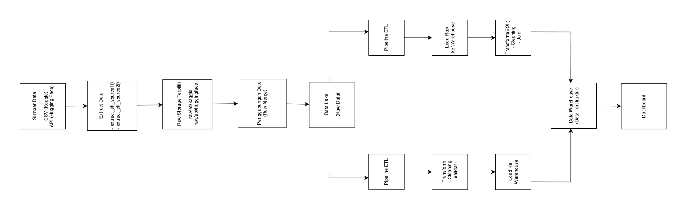

# Diagram Arsitektur Sistem Big Data

Folder ini berisi diagram arsitektur sistem Big Data
yang digunakan pada proyek **ETL dan ELT Steam Games Analytics**.

Diagram menggambarkan alur data secara end-to-end,
mulai dari proses extract data hingga visualisasi dashboard.

---

## 🧭 Alur Sistem Berdasarkan Diagram

Berdasarkan diagram arsitektur yang ditampilkan, alur sistem
dibangun dengan tahapan sebagai berikut:

1. **Sumber Data**
   - Dataset CSV (Kaggle)
   - Dataset Hugging Face

2. **Extract Data**
   - Data diekstraksi dari masing-masing sumber
   - Tidak dilakukan preprocessing atau cleaning
   - Data masih dalam kondisi mentah (raw)

3. **Raw Storage (Penyimpanan Sementara)**
   - Data hasil extract disimpan sebagai raw data
   - Digunakan sebagai input untuk tahap selanjutnya

4. **Penggabungan Data (Raw Merge)**
   - Data dari CSV dan Hugging Face digabungkan
   - Penggabungan dilakukan sebelum proses transformasi
   - Tujuan: menyatukan data multisumber dalam satu alur

5. **Data Lake (Raw Data)**
   - Menyimpan data mentah hasil penggabungan
   - Menjadi sumber untuk dua jalur pipeline:
     - Pipeline ETL
     - Pipeline ELT

---

## 🔄 Jalur Pipeline ETL

Pada jalur **ETL**, alur pemrosesan data adalah:

1. **Pipeline ETL**
   - Data diambil dari Data Lake
   - Dilakukan proses:
     - Data cleaning
     - Standardisasi data
     - Feature engineering
     - Validasi kualitas data

2. **Load ke Data Warehouse**
   - Data yang sudah bersih dan terstruktur
     dimasukkan ke data warehouse (SQLite)

---

## 🔁 Jalur Pipeline ELT

Pada jalur **ELT**, alur pemrosesan data adalah:

1. **Load Raw ke Warehouse**
   - Data mentah langsung dimasukkan ke warehouse
   - Tanpa preprocessing di tahap awal

2. **Transform di Warehouse**
   - Cleaning dan transformasi dilakukan menggunakan
     query SQL di dalam warehouse

---

## 🏢 Data Warehouse

Data warehouse berfungsi sebagai penyimpanan data terstruktur
yang siap digunakan untuk analisis.

Struktur utama warehouse:
- `dim_game`
- `dim_time`
- `fact_game_metrics`

Warehouse menjadi titik temu hasil dari pipeline ETL dan ELT.

---

## 📊 Dashboard Analitik

Data dari data warehouse digunakan sebagai sumber
dataset dashboard.

- Data diekspor ke format CSV
- CSV dihubungkan ke Google Looker Studio
- Dashboard menampilkan:
  - KPI utama
  - Tren waktu
  - Distribusi data
  - Perbandingan performa game
  - Filter interaktif

---

## 🖼️ Diagram Arsitektur

